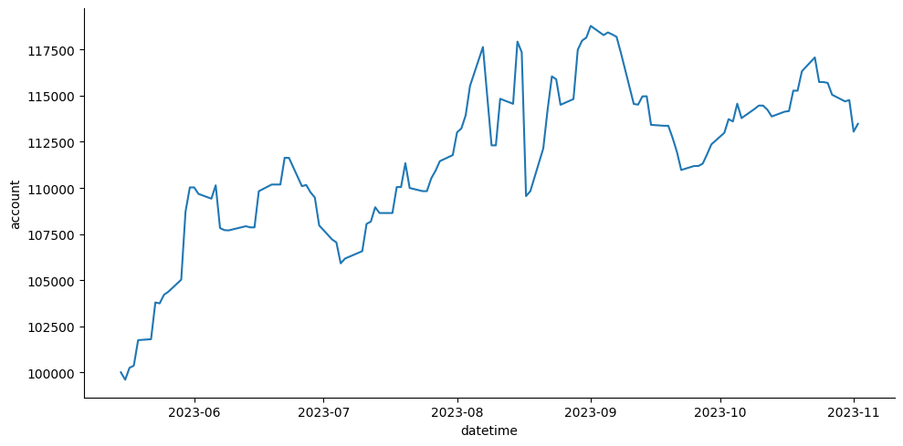
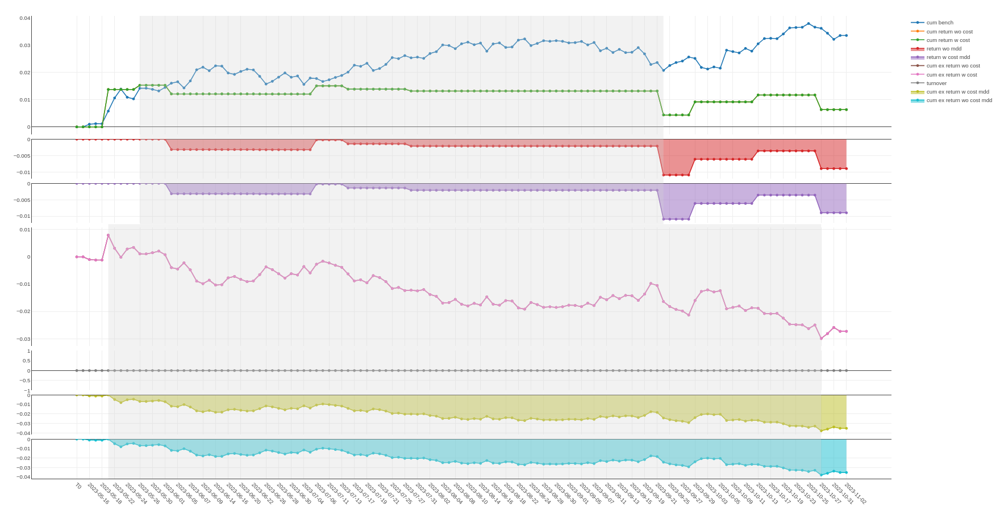

# QBotForStocks

### Для работы

Код для установки библиотеки **Qlib**:

```
!git clone https://github.com/microsoft/qlib.git
!cd qlib && pip install . -q
```

[Model Training](model_training.ipynb) - пример тренировки модели для бота

### Использование

Пример работы c ботом:

```
bot = MarketBot('./hours', './moex_data_hours', 100000)
bot.load_model('./alstm_model')

output = bot.get_states(datasets)
actions = get_actions(output, datasets)
```

```MarketBot``` - бот со стратегией

```output``` - объект из библиотеки **Qlib**

```actions``` - готовый для дальнейшего использования объект

### Примерные результаты


